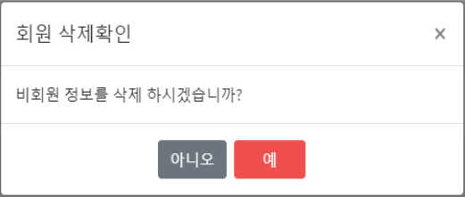

# 동백씨네마 (Dongbaek Cinema) – 영화 예매 웹앱

> 사용자는 영화를 예매하고, 관리자는 영화 등록 및 관리를 할 수 있는 웹 애플리케이션입니다.

---

### 📌 자료
- **PPT 보기:** [동백씨네마_PPT.pdf](docs/동백씨네마.pdf)

---

## 관리자 페이지 회원관리

### 화면 예시
 
- <strong>기능</strong>: 
  - <strong>CRUD</strong>: 회원 관리 기능 (생성, 읽기, 수정, 삭제) 
  - 비회원 버튼 클릭 시 삭제 모달 출력 
  - <strong>검색</strong>: 이름, 아이디, 멤버십으로 검색 
  - 수정, 삭제 시 모달창으로 확인  

 
- <strong>기능</strong>: 회원의 <strong>상세 정보</strong>를 확인하고 수정할 수 있는 페이지입니다.  

 
- <strong>기능</strong>: 회원 정보 삭제 시 <strong>확인 모달</strong>이 출력됩니다.  

---

## 관리자 페이지 영화관리

### 화면 예시
 
- <strong>기능</strong>: 영화 목록을 표시하고 관리하는 페이지입니다.  

 
- <strong>기능</strong>: 영화 <strong>등록</strong> 기능, 필수 입력값 및 중복 검사 후 등록합니다.  

 
- <strong>기능</strong>: <strong>영화 정보 수정</strong> 시 모달 창을 사용하여 변경할 수 있습니다.  

---

## 관리자 페이지 결제관리

### 화면 예시
 
- <strong>기능</strong>: 결제 관리 페이지에서 <strong>결제 내역</strong>을 관리합니다.  

 
- <strong>기능</strong>: <strong>결제 취소</strong> 기능을 제공하며, 결제 취소 시 확인을 위한 모달창이 나타납니다.  

---

### 🛠 프로젝트 개요
- **기간:** 2023‑05‑17 ~ 2023‑06‑30  
- **팀 구성:** 7명 (부산 ITWILL 교육센터 팀 프로젝트)

### 🔧 기술 스택
- **언어**: Java, JSP, HTML, CSS, JavaScript  
- **프레임워크/라이브러리**: Spring, MyBatis, jQuery, AJAX, Bootstrap  
- **서버/DB**: Apache Tomcat, MySQL  
- **도구**: GitHub, Notion, Discord, Google Drive

---

### 🎯 담당 역할
- 관리자 페이지 CRUD 구현
- KOBIS API 연동  
- I’mport API 결제 연동  

---

### ✨ 회고 & 성과
> 처음으로 진행한 개발 프로젝트였기 때문에 시간이 부족하다고 느꼈지만, 팀원들과 역할을 분담하고 협력하여 프로젝트를 마무리할 수 있었습니다.  
> 개발 절차를 따르며 전반적인 개발 흐름을 이해하는 데 큰 도움이 되었고, API 연동 과정에서 발생한 오류를 분석하고 해결하며 문제 해결 능력을 강화할 수 있었습니다.  
> 또한, 문제 해결 과정에서 팀워크와 주석의 중요성을 재확인했으며, 다음 프로젝트에서는 공동 코드 작성 및 협업 방식을 개선할 계획입니다.
